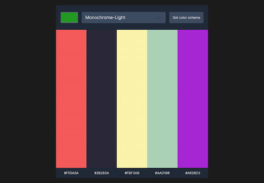

# Scrimba - Solo Project: Color Scheme Generator

This is a solution to the [Solo Project: Color Scheme Generator](https://scrimba.com/learn/frontend).

## Table of contents

- [Overview](#overview)
  - [The challenge](#the-challenge)
  - [Screenshot](#screenshot)
- [My process](#my-process)
  - [Built with](#built-with)
- [Author](#author)

## Overview

### The challenge

- Choose 'seed color' with an `<input type='color'>`
- Choose color schene mode in a `<select>` box
- Clicking the buton makes request to The Color API
- Display the scheme colors and hex values on the page
- Stretch goal: click hex values to copy to clipboard

### Screenshot

### Links

- Solution URL: [GitHub](https://github.com/graficdoctor/solo-project-color-scheme-generator)
- Live Site URL: [Vercel](https://solo-project-color-scheme-generator.vercel.app/)
- Code Review on [Scrimba](https://scrimba.com/scrim/co315440ab5fa6aedb5874ee1)

## Updated Mistake

- After having uploaded the code and shared it on Scrimba, I was pointed out an error. I had already declared the `colorSeed`-variable with its value. This caused the app to always have black as a starting color and base its functioning in this value.
- The code I changed is: `const colorSeed = document.getElementById('seed-color');`
- I also moved the `colorHex`-variable down into the function and have the `.value` added here: `const colorSeedHex = colorSeed.value.replace('#', '');`. This way the value isn't loaded when the app is loaded, but when the users clicks on the color-input-field.

### Built with

- Semantic HTML5 markup
- CSS custom properties
- Flexbox
- CSS Grid

## Author

- Website - [Katrien S.](https://www.katriens.be)
- Twitter - [@graficdoctor](https://www.twitter.com/graficdoctor)
